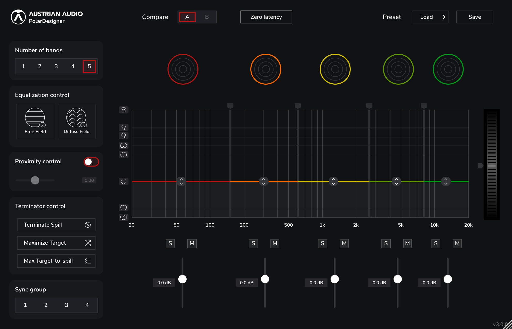

# PolarDesigner

This is PolarDesigner Version 3

Our open-source plug-in developed by [Thomas](github.com/thomasdeppisch),
[Simon](github.com/becksimon), [IEM](https://iem.kug.ac.at) and [Austrian Audio](https://austrian.audio).

PolarDesigner allows you to control the polar pattern of your OC818 microphone in up to five frequency bands.
Available as VST3, AAX and AU. Get installers for Windows and Mac at [austrian.audio](https://austrian.audio).



## Downloads

https://austrian.audio/polardesigner

## Building PolarDesigner3 from source

Requirements:

- cmake
- a C++20 compatible compiler (GCC, clang, MSVC)

To build from source, you need to clone the repo and its submodules

```bash
git clone https://github.com/AustrianAudioGmbH/PolarDesigner.git
cd PolarDesigner
git submodule update --init --recursive
```

After that, create a build directory, configure & compile with

```bash
mkdir build && cd build
cmake ..
cmake --build . --config Release
```

## Acknowledgements:

PolarDesigner 3 makes use of the following projects:

- [JUCE (audio application framework)](https://juce.com)
- [FFTW3 (Windows/Linux FFT backend)](https://fftw.org/)
- [Apple vDSP (MacOS FFT backend)](https://developer.apple.com/accelerate/)
- [Pamplejuce (Audio plugin template)](https://github.com/sudara/Pamplejuce)
- [pluginval (VST Plugin validation tests)](https://github.com/Tracktion/pluginval)
- [Catch2 (Unit testing framework)](https://github.com/catchorg/Catch2)
